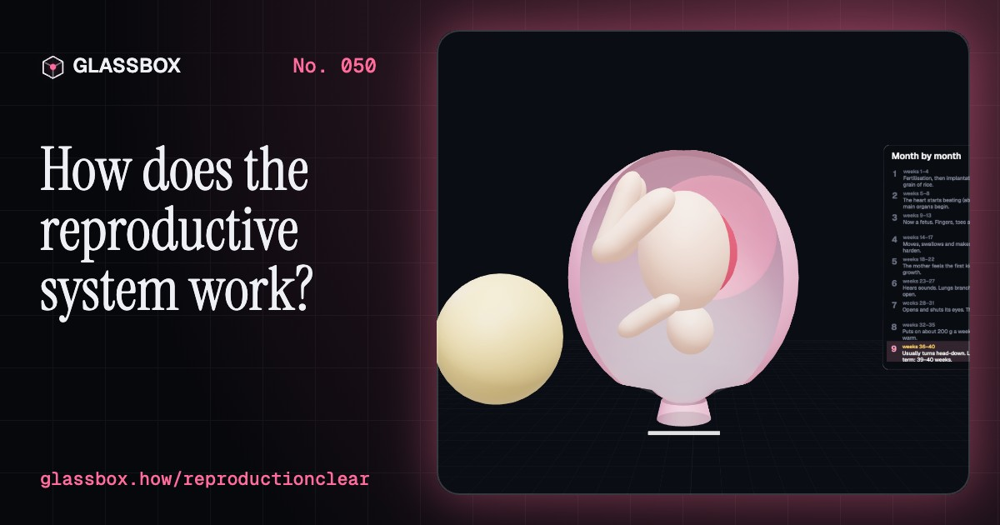
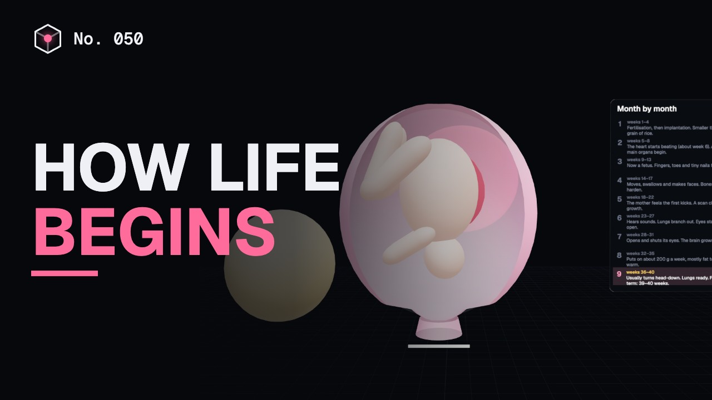
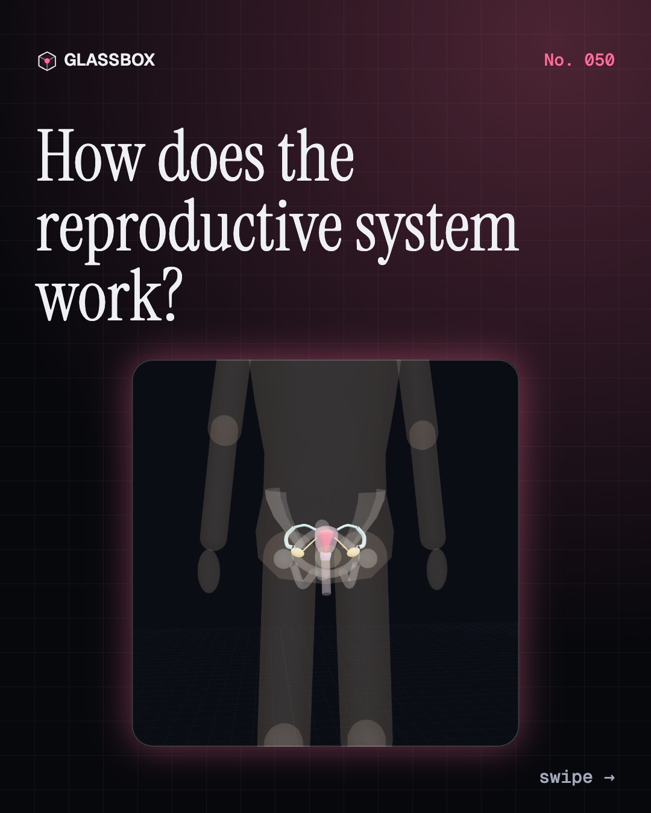
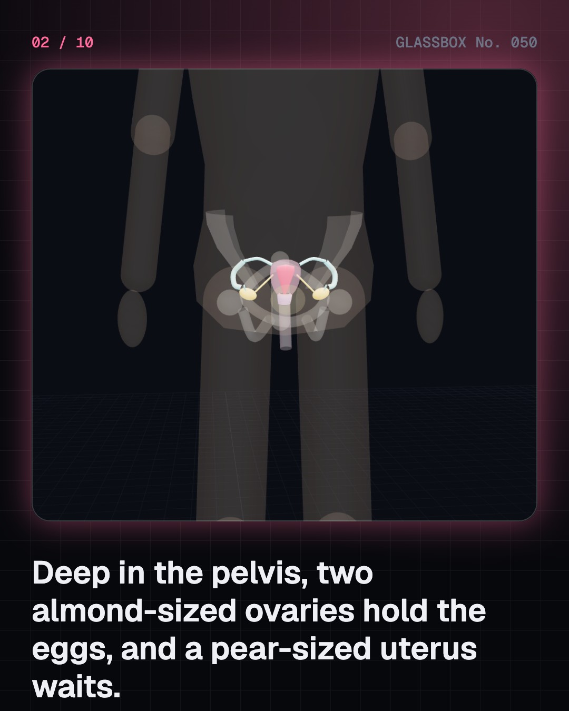
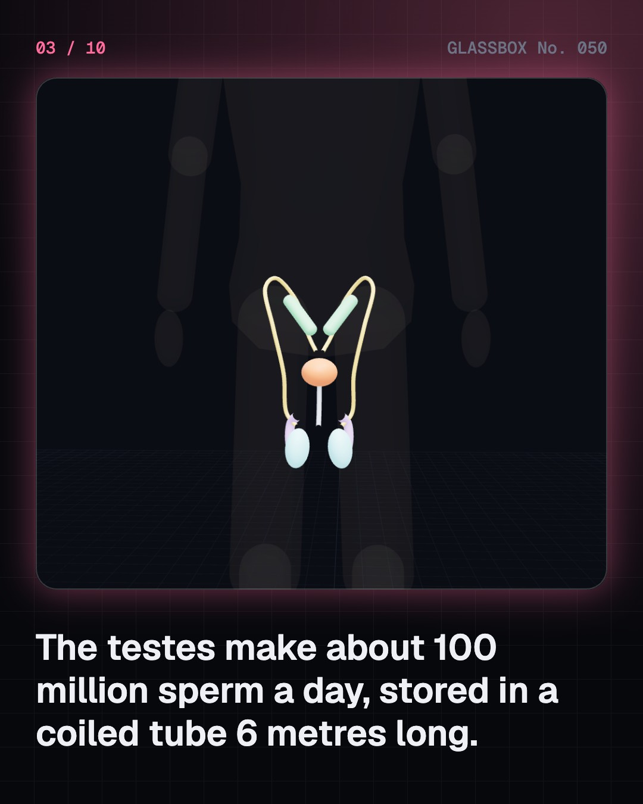
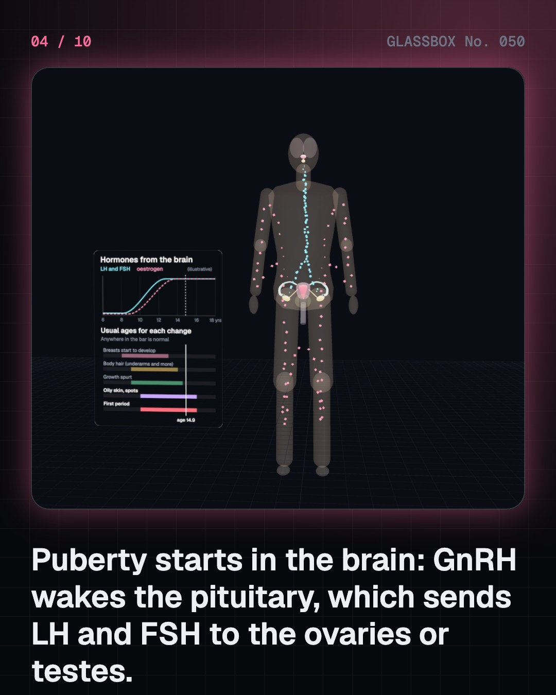

<!-- glassbox:start -->
<!-- Generated from glassbox.json by the Glassbox hub (npm run readme -- reproductionclear). Edit glassbox.json, not this block. -->
<p align="center"><a href="https://glassbox-production-fd52.up.railway.app/e/reproductionclear/"></a></p>

<h1 align="center">ReproductionClear</h1>

<p align="center"><b>How does the reproductive system work?</b><br>Two small sets of organs, deep in the pelvis, can start a whole new person. See the organs as clean diagrams, watch the brain switch on puberty, run the 28-day cycle as a clock, follow one sperm and one egg become a ball of cells, and grow a baby from a lentil to a watermelon.</p>

<p align="center"><a href="https://glassbox-production-fd52.up.railway.app/reproductionclear/"><b>▶ Play with it</b></a> &nbsp;·&nbsp; <a href="https://glassbox-production-fd52.up.railway.app/e/reproductionclear/">Read the 60-second explainer</a> &nbsp;·&nbsp; <a href="https://glassbox-production-fd52.up.railway.app/reproductionclear/glassbox/reel.mp4">Watch the 40-second video</a></p>

<p align="center">
  <a href="https://glassbox-production-fd52.up.railway.app/e/reproductionclear/"></a>
  <a href="https://glassbox-production-fd52.up.railway.app/e/reproductionclear/"></a>
  <a href="LICENSE"></a>
  <a href="LICENSE-CONTENT.md"></a>
  <a href="#privacy"></a>
</p>

## In 60 seconds

1. **Two sets of organs.** Ovaries store eggs and release about one a month into the fallopian tubes, which lead to the uterus. Testes make about 100 million sperm a day, which mature in the epididymis and travel up the vas deferens. Ovaries and testes are also glands that make hormones.
2. **Puberty starts in the brain.** The hypothalamus starts pulsing GnRH, the pituitary answers with LH and FSH, and the ovaries or testes make oestrogen or testosterone. It usually begins between 8 and 13 in girls and 9 and 14 in boys, and early or late in that range is normal.
3. **A monthly clock.** A cycle lasts 21 to 35 days. A follicle ripens, an LH surge releases the egg about 14 days before the next period, and progesterone thickens the lining. If no baby starts, the lining is shed as a period: normal, healthy and nothing to be ashamed of.
4. **23 + 23 = 46.** In the fallopian tube, one sperm gets through the egg's coat and the coat hardens behind it. The zygote has 46 chromosomes. It divides as it drifts to the uterus, becomes a hollow blastocyst and implants around days 6 to 10. The sperm's X or Y sets the baby's sex.
5. **Forty weeks.** From a lentil with a beating heart at week 6 to about 3 to 3.5 kg at week 40. The placenta passes oxygen and food from the mother's blood to the baby's, and waste back, without the two ever mixing. Birth comes as the uterus squeezes and the cervix opens to about 10 cm.
6. **Care and respect.** Check-ups keep mothers and babies safe: India's maternal mortality fell from 398 to 88 per 100,000 births between 1997–98 and 2020–22. Infections are treatable and infertility is common and often treatable. Your body belongs to you: always ask, and respect a no.

## Words worth knowing

| Term | Meaning |
|---|---|
| **Gamete** | A sex cell, an egg or a sperm, carrying 23 chromosomes. |
| **Ovary** | An almond-sized organ that stores eggs and makes oestrogen and progesterone. |
| **Testis** | An organ that makes sperm and testosterone, kept a little cooler than the body. |
| **Puberty** | The years when the body matures, started by GnRH from the brain. |
| **Menstrual cycle** | The monthly cycle of egg release and lining growth and shedding, usually 21 to 35 days. |
| **Ovulation** | The release of an egg, about 14 days before the next period. |
| **Fertilisation** | One sperm and one egg joining in the fallopian tube to make a zygote. |
| **Placenta** | The organ on the uterus wall where the baby's blood takes oxygen and food from the mother's. |
| **Consent** | Freely saying yes. Everyone has the right to say no about their own body. |

## A short history

**From a beating spot in a hen's egg to IVF babies in Oldham and Kolkata: how people learned where life begins.**

- **1672** · Bubbles in the ovary (Regnier de Graaf, Delft, Netherlands)
- **1677** · Sperm seen for the first time (Antonie van Leeuwenhoek (with Johan Ham), Delft, Netherlands)
- **1827** · The mammal egg is found (Karl Ernst von Baer, Königsberg, Prussia (now Kaliningrad, Russia))
- **1876** · Watching one sperm enter an egg (Oscar Hertwig, Mediterranean coast (sea urchin eggs); based at Jena, Germany)
- **1905** · The X and Y chromosomes (Nettie Stevens, Bryn Mawr College, Pennsylvania, USA)
- **1956** · Humans have 46 chromosomes (Joe Hin Tjio and Albert Levan, Lund, Sweden)
- **1958** · Seeing the baby with sound (Ian Donald, John MacVicar and Tom Brown, Glasgow, Scotland)
- **1978** · Louise Brown, the first IVF baby (Patrick Steptoe and Robert Edwards (with Jean Purdy), Oldham, England)

The full story, with 27 moments, charts, people and 51 sources: [glassbox.how/e/reproductionclear/history](https://glassbox-production-fd52.up.railway.app/e/reproductionclear/history/). The data lives in [`history.json`](history.json).

## Video and slides

Made with the Glassbox studio from this box's storyboard (`window.glassbox.director`). Free to reuse under CC BY 4.0.

<a href="https://glassbox-production-fd52.up.railway.app/reproductionclear/glassbox/video.mp4"></a>

<p><a href="glassbox/slide-1.jpg"></a> <a href="glassbox/slide-2.jpg"></a> <a href="glassbox/slide-3.jpg"></a> <a href="glassbox/slide-4.jpg"></a></p>

| File | What | Size |
|---|---|---|
| [`glassbox/reel.mp4`](https://glassbox-production-fd52.up.railway.app/reproductionclear/glassbox/reel.mp4) | Reel / Short, with captions and soundtrack | 1080×1920 |
| [`glassbox/video.mp4`](https://glassbox-production-fd52.up.railway.app/reproductionclear/glassbox/video.mp4) | YouTube video, with captions and soundtrack | 1920×1080 |
| `glassbox/slide-1…10.jpg` | Instagram carousel | 1080×1350 |
| `glassbox/thumb.jpg` | YouTube thumbnail | 1280×720 |
| `glassbox/cover.jpg` | Share card and repo social preview | 1200×630 |
| [`glassbox/history-reel.mp4`](https://glassbox-production-fd52.up.railway.app/reproductionclear/glassbox/history-reel.mp4) | “History in 10 moments” Reel / Short | 1080×1920 |
| `glassbox/history-slide-*.jpg` | History carousel | 1080×1350 |
| `glassbox/post.json` | Post copy and schedule used by the publish kit | |

## Privacy

This box has no accounts and no ads, and it ships its own fonts and libraries. When you run it yourself it sends nothing anywhere. On glassbox.how, the site's `/bar.js` also loads Glassbox's analytics: **Google Analytics** to count visits (it asks first in the EU, UK and Switzerland, and stays off when your browser sends Global Privacy Control or Do Not Track) and **ClickTrust** to detect bots.

It remembers a few things **in your own browser only**, and never sends them anywhere:

| Browser storage key | What it holds |
|---|---|
| `reproductionclear.v1` | Which chapters you have opened, your best quiz scores, and sound on or off. |

Exactly what each one sees is at [glassbox.how/privacy](https://glassbox-production-fd52.up.railway.app/privacy/).

## Licences

- **Code:** [MIT](LICENSE). Use it, change it, ship it.
- **Explanations, text, images and videos** (`glassbox.json`, `glassbox/`): [CC BY 4.0](LICENSE-CONTENT.md). Credit “Glassbox, glassbox.how/e/reproductionclear”.
- **Third-party parts** keep their own licences: [three.js](https://threejs.org) (MIT), [Geist, Instrument Serif](https://openfontlicense.org) (SIL OFL 1.1).
- The Glassbox name and logo aren't covered by either licence. See the [terms](https://glassbox-production-fd52.up.railway.app/terms/).

Found a mistake? [Open an issue](https://github.com/bdeeps/reproductionclear/issues). Corrections happen in public.
<!-- glassbox:end -->

## Run it

It's plain HTML, CSS and JavaScript. No build step and no dependencies. Run locally, it contacts no other website.

```bash
python3 -m http.server 8000
```

Three.js and the fonts ship in `vendor/` and `fonts/`, so it also works offline.

Then open http://localhost:8000.

## How it's built

| File | What |
|---|---|
| `index.html`, `css/app.css` | The page and its styles |
| `js/app.js`, `js/stage.js`, `js/ui.js`, `js/kit.js` | The shared Glassbox 3D engine: chapters, 3D stage, controls, quiz, video director |
| `js/chapters/*.js` | One file per chapter: the 3D model, controls, text, key terms, quiz and video scenes |
| `js/repro.js` | The neutral ghost figure, the ghosted pelvis, the internal reproductive organs as diagrams, particle streams, chart boards, the menstrual-cycle hormone model and the week-by-week growth table, with sources |
| `glassbox.json` | Title, question, explainer beats, key terms, browser storage and credits shown on glassbox.how |
| `reel` in each chapter | The storyboard the Glassbox studio records into short videos |
| `glassbox/` | The published video, slides, thumbnail and post copy |
| `fonts/`, `vendor/three/` | Self-hosted Geist and Instrument Serif (SIL OFL 1.1) and three.js (MIT) |
